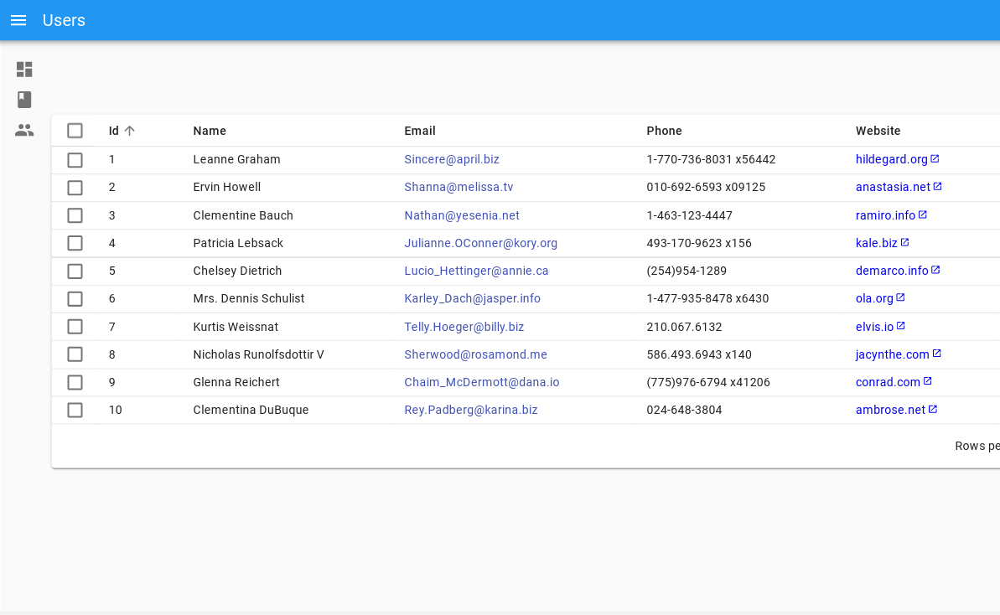
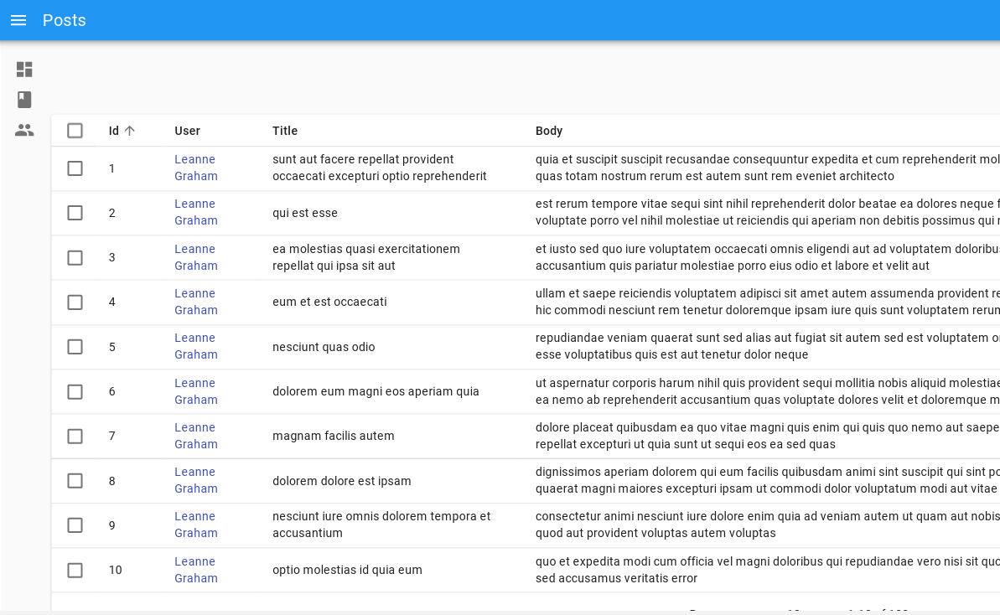

<h1 align="center">React-Admin Tutorial</h1>

## Table of Contents

- [Overview](#overview)
  - [Built With](#built-with)
  - [Takeaways](#takeaways)
- [Useful Resources](#useful-resources)

## Overview

How to create a new admin app based on an existing REST API.

Have to enable cookies to get to the dashboard.  

### Built With

- React
- React-Admin

### Takeaways

- Admin component is the root component of a react-admin app.
- Admin expects a dataProvider prop which is a function that fetches data from an api.
- Resource defines the react components to use for each CRUD operation.
- By default, react-admin displays the list page of the first resource element as homepage.

- ListGuesser is not for production and should be replaced with a custom component.
- Check the console to get a basic structure for that custom component. 

- Pass an array of input components to the list filters prop to enable filtering.

- Edit / Creating you will see the change before the api sends the post request.  Can undo within ~5 seconds.

- React admin makes no assumption about your authentication strategy.  Whatever it is -> pass it to the authProvider prop.
- authProvider calls are asynch.

- Writing to a Data Provider is the probably the first thing you'll have to do to make react-admin work. 
- You will have problems with headers.  

- Working thru the tutorial reminded me of Airtable.  

- React-admin 4.0 is coming soon and there seems to be a lot of breaking changes under the hood so I may have return to this later.   

## Useful Resources

- [YouTube](https://www.youtube.com/watch?v=HRmdj-HpJyE) - React Admin Crash Course
- [Marmelab](https://marmelab.com/react-admin/Tutorial.html) - React Admin Tutorial
- [Stack Overflow](https://stackoverflow.com/questions/59590915/how-to-use-auth0-with-react-admin) - auth0 with react-admin
- [Github](https://github.com/spintech-software/react-admin-auth0-example) - uses React Router 5 
- [YouTube](https://www.youtube.com/watch?v=3m5An-s0r-k) - React Admin Grandmaster
- [Stack Overflow](https://stackoverflow.com/questions/50724915/is-it-possible-to-have-multiple-dataproviders-in-react-admin) - multiple dataproviders?
- [Stack Overflow](https://stackoverflow.com/questions/47245456/error-the-content-range-header-is-missing-in-the-http-response/51005007) - content range header
- [Blog](https://dvddpl.github.io/2021/01/26/range-not-satisfiable-error-in-react-admin.html) - range error